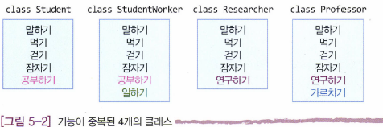
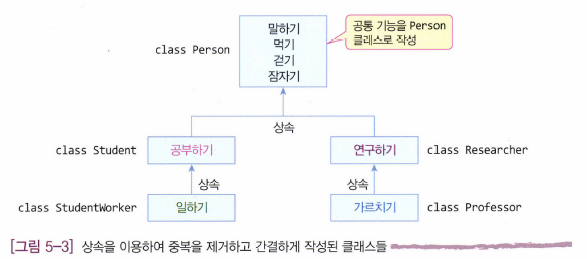
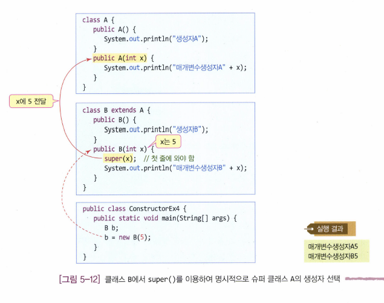
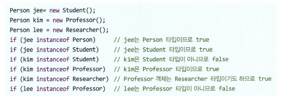
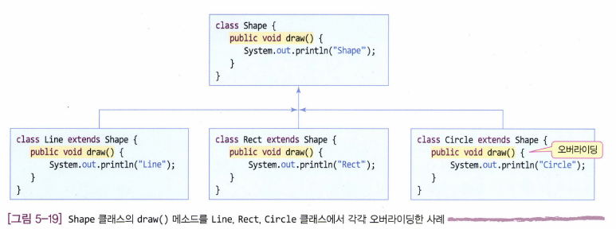

# 1. 상속의 개념

`객체 지향` 에서 상속은 **부모 클래스에 만들어진 필드와 메소드를 자식 클래스가 물려 받는 것**이다.

한 가지 분명히 짚고 넘어가야 할 것은, 상속은 **클래스 사이의 상속**이지 객체 사이의 상속이 아니라는 점이다. 다시 말해, 자식 객체는 자식 클래스와 부모 클래스에 만들어진 모든 멤버를 가지고 생성된다.

# 2. 상속의 필요성

상속의 가장 큰 목적은 **코드의 재사용**이다. 더 빠르고 유지보수가 쉽고, 중복이 적고, 통일성이 있는 코드를 작성하기 위해 상속을 사용한다.

예1: 말하기 메소드를 수정하려면 네 메소드를 모두 수정해야 함



예2: 부모 클래스 `Person` 의 말하기만 수정하면 해당 클래스를 상속 받은 모든 자식 클래스의 메소드가 수정됨.



# 3. 상속의 장점

객체 지향에서 상속이 가져다주는 장점을 간략히 정리하면 다음과 같다.

- 클래스의 간결화 - 멤버의 중복 작성 불필요
- 클래스 관리 용이 - 클래스들의 계층적 분류
- 소프트웨어의 생산성 향상 - 클래스 재사용과 확장 용이

# 4. 상속 선언

자바에서는 부모 클래스를 `슈퍼 클래스(super class)`, 상속받는 자식 클래스를 `서브 클래스(sub class)`라고 부르며, 상속을 선언할 때 확장한다는 뜻을 가진 `extends` 키워드를 사용한다.

Student 클래스는 Person 클래스의 멤버를 물려받으므로, Person 클래스의 필드나 메소드를 자동으로 상속받게 된다.

```java
/*슈퍼 클래스*/
public class Person {
    ...
}

/*서브 클래스*/
public class Student extends Person { // Person 을 상속받는 클래스 Student 선언
    ...
}

```

# 5. 상속 활용

1. `private` 접근 제한자는 자식 메소드에서도 참조 불가하므로 `a` 필드는 참조 불가
2. `public` 접근 제한자의 `b` 필드는 자식에서 선언하지 않았지만 `Parent` 에서 선언한 걸 상속받았으므로 참조 가능
3. 자식인 `Child` 에서 선언한 `c` 필드는 당연히 `Child` 에서 참조 가능

```java
class Parent {
    private int a = 10; // private 필드
    public int b = 20;  // public 필드
}

class Child extends Parent {
    public int c = 30;  // public 필드
    void display() {
①      // System.out.println(a);               // 상속받은 private 필드 참조 (오류)
②      System.out.println(b);    // 상속받은 public 필드 참조
③      System.out.println(c);    // 자식 클래스에서 선언한 public 필드 참조
    }
}

public class Inheritance01 {
    public static void main(String[] args) {
        Child ch = new Child();
        ch.display();
    }
}
```

# 6. 자바 상속의 특징

1. 자바에서는 클래스의 다중 상속을 지원하지 않는다. 그러므로 `extends` 다음에는 클래스 이름을 하나만 지정할 수 있다.
2. 자바에서는 상속의 횟수에 제한을 두지 않는다.
3. 자바에서 계층 구조의 최상위에 `java.lang.Object` 클래스가 있다. (사용자가 만들든 자바패키지에서 제공하든, 자바에서 모든 클래스는 `Object` 클래스를 자동으로 상속받도록 컴파일 된다.)

# 7. 상속과 접근 지정

멤버에 대한 잡근 지정자는 4장에서 다루었으므로, 여기서는 상속과 관련하여 **슈퍼클래스의 멤버 접근 지정에 따라 서브 클래스나 다른 클래스에서 슈퍼 클래스의 멤버를 접근할 수 있는지**를 알아보겠다.

- 슈퍼클래스의 private 멤버: 슈퍼 클래스의 멤버가 `private` 로 선언되면, **서브 클래스를 포함하여 다른 어떤 클래스에서도 접근할 수 없다.** `private` 은 오직 '현재 클래스의 멤버들에게만 접근을 허용 한다' 라는 뜻이다.
- 슈퍼클래스의 default 멤버: 슈퍼 클래스의 멤버가 `default` 로 선언되면, **패키지에 있는 모든 클래스**가 접근 가능하다. **서브 클래스라도 다른 패키지에 있다면, 슈퍼 클래스의 디폴트 멤버는 접근할 수 없다.**
- 슈퍼클래스의 public 멤버: 슈퍼 클래스의 멤버가 `public` 으로 선언되면, 같은 패키지에 있든 다른 패키지에 있든 모든 클래스에서 접근할 수 있다.
- 슈퍼클래스의 protected 멤버: 슈퍼 클래스의 `protected` 멤버는 **같은 패키지에 속한 모든 클래스들**, 그리고 **같은 패키지든 다른 패키지든 상속받는 `서브 클래스` 의 경우**에 접근을 허용한다.

# 8. 상속과 생성자

서브 클래스와 슈퍼 클래스는 각각의 `생성자` 를 가지고 있다.

질문1. 서브 클래스 객체가 생성될 때 서브 클래스의 생성자와 슈퍼 클래스의 생성자가 모두 실행되는가? 아니면 서브 클래스의 생성자만 실행되는가?

> 둘다 실행된다

질문2. 서브 클래스의 생성자와 슈퍼 클래스의 생성자 중 누가 먼저 실행되는가?

> 슈퍼 클래스의 생성자가 먼저 실행된 후 서브 클래스의 생성자가 실행된다.

---

**슈퍼 클래스에 여러 개의 생성자가 있는 경우**

원칙적으로 서브 클래스의 개발자가 서브 클래스의 각 생성자에 대해, 함께 실행될 슈퍼 클래스의 생성자를 지정해야 하지만, 지정하지 않는 경우 컴파일러는 자동으로 슈퍼 클래스의 기본 생성자를 호출하도록 컴파일한다.

---

**super()**

`super()` 는 **슈퍼 클래스 생성자를 호출** 하는 코드이다. 괄호 안에 인자를 전달하여 슈퍼 클래스의 생성자를 호출할 수도 있다. 중요한 것은 **`super()` 는 반드시 생성자의 첫 라인**에 사용되어야 한다.



# 9. 업캐스팅, 다운캐스팅

- 업캐스팅: 자식의 멤버들이 소실됨

```java
Parent p;
Student s = new Student();
p = s; // 업캐스팅 (int i = double d;)

/* 혹은 */

Parent p = new Student();
```

- 다운캐스팅: 업캐스팅과 달리 **명시적으로 타입 변환** 을 지정해야 한다.
- ```java
  Student s = (Student)p; // 다운캐스팅 (double d = int i;)
  ```

# 10. instanceof 연산자와 상속

`instanceof` 연산자는 '레퍼런스'가 가리키는 객체가 해당 클래스의 타입이면 true, 아니면 false 인 boolean 값을 리턴한다.



instanceof는 클래스에만 적용되므로 다음은 오류이다.

```java
if(3 instanceof int) // 문법 오류. instanceof 는 객체에 대한 레퍼런스만 사용
```

> 다음 instanceof 연산은 true이다.
>
> ```java
> if("java" instanceof String) // true
> ```

# 11. 메소드 오버라이딩, 메소드 오버로딩

- 메소드 오버라이딩(overriding): **재작성**
  메소드 오버라이딩은 슈퍼 클래스와 서브 클래스의 메소드 사이에 발생하는 관계로서, 슈퍼 클래스에 선언된 메소드와 같은 이름, 같은 리턴 타입, 같은 매개 변수 리스트를 갖는 메소드를 서브 클래스에서 **재작성**하는 것이다. 서브클래스의 개발자는 슈퍼 클래스에 있는 메소드로 목적하는 바를 이룰 수 없을 때 동일한 이름의 메소드를 서브 클래스에 다시 작성할 수 있다.

  

  오버라이딩의 제약사항:

  1. 슈퍼 클래스의 메소드와 **동일한 원형**으로 작성한다. (이름, 매개변수, 리턴 타입)
  2. 슈퍼 클래스 메소드의 접근 지정자보다 **접근의 범위를 좁힐 수 없다**.
- 메소드 오버로딩(overloading): **중복 정의**
  메소드 오버로딩이란 같은 이름의 메소드를 **중복하여 정의**하는 것을 의미한다.

  메소드 오버로딩의 핵심은 바로 **메소드 시그니처(method signature)**에 있습니다. 메소드 시그니처란 메소드의 선언부에 명시되는 매개변수의 리스트를 가리킵니다.

  만약 두 메소드가 매개변수의 개수와 타입, 그 순서까지 모두 같다면, 이 두 메소드의 시그니처는 같다고 할 수 있습니다.

  ---

  메소드 오버로딩의 조건:


  1. 메소드의 이름이 같아야 한다.
  2. 메소드의 시그니처, 즉 매개변수의 개수 또는 타입이 달라야 한다.

  오버라이딩은 상속 관계에서만 성립하지만 오버로딩은 동일한 클래스 내 혹은 상속 관계 둘 다 가능하다.

메소드 오버로딩 예제

`println()` : 매개변수 타입에 따라

```java
1. println()
2. println(boolean x)
3. println(char x)
4. println(char[] x)
5. println(double x)
6. println(float x)
7. println(int x)
8. println(long x)
9. println(Object x)
10. println(String x)
```

또다른 예제:

```java
void display(int num1)              // 전달받은 num1을 그대로 출력함.
void display(int num1, int num2)    // 전달받은 두 정수의 곱을 출력함.
void display(int num1, double num2) // 전달받은 정수와 실수의 합을 출력함.

display(10);       // 1번 display() 메소드 호출 -> 10
display(10, 20);   // 2번 display() 메소드 호출 -> 200
display(10, 3.14); // 3번 display() 메소드 호출 -> 13.14
display(10, 'a');  // 2번과 3번 모두 호출 가능
```

---

오버로딩과 오버라이딩 사이의 차이점 정리

| 비교 요소 | 메소드 오버로딩                                                                   | 메소드 오버라이딩                                                                                                     |
| :-------: | --------------------------------------------------------------------------------- | --------------------------------------------------------------------------------------------------------------------- |
|   선언   | 같은 클래스나 상속 관계에서<br />동일한 이름의 메소드 중복 작성                   | 서브 클래스에서 슈퍼 클래스에 있는<br />메소드와 동일한 이름의 메소드 재작성                                          |
|   관계   | 동일한 클래스 내 혹은 상속 관계                                                   | 상속 관계                                                                                                             |
|   목적   | 이름이 같은 여러 개의 메소드를 중복<br />작성하여 사용의 편리성 향상, 다형성 실현 | 슈퍼 클래스에 구현된 메소드를 무시하고<br />서브 클래스에서 새로운 기능의 메소드를<br />재정의 하고자 함, 다형성 실현 |
|   조건   | 메소드 이름은 반드시 동일하고, 매개변수<br />타입이나 개수가 달라야 성립          | 메소드의 이름, 매개변수 타입과 개수,<br />리턴 타입이 모두 동일하여야 성립                                            |
|  바인딩  | 정적 바인딩,<br />호출될 메소드는 컴파일 시에 결정                                | 동적 바인딩, 실행 시간에 오버라이딩된<br />메소드를 찾아 호출                                                         |

# 12. super, super()

1. `super` : 슈퍼 클래스의 멤버에 접근하는 키워드 `super.슈퍼클래스의멤버`

   ```java
   name = "Child";		// Child 클래스의 name 에 "Child" 기록
   super.name = "Parent";	// Parent 클래스의 name 에 "Parent" 기록
   super.draw();		// Parent 클래스의 draw() 호출. 정적 바인딩
   ```
2. `super()` : 앞서 언급했듯 서브 클래스에서 슈퍼 클래스의 생성자를 호출할 때 사용

# 13. 추상메소드, 추상클래스

추상메소드(abstract method): 선언은 되어 있으나 코드가 구현되어 있지 않은, 즉 껍데기만 있는 메소드다. 추상 메소드를 작성하려면 `abstract` 키워드와 함께 원형만 선언하고 코드는 작성하지 않는다.

```java
public abstract String getName();
public abstract void setName(String s);
```

추상클래스(abstract class): `abstract` 키워드로 다음과 같이 추상 메소드를 포함하거나, 추상 메소드 없이 선언할 수 있다.

- 추상 메소드를 포함하는 클래스

  ```java
  abstract class Shape {	// 추상 클래스 선언
  	public Shape() {}
  	public void paint() {draw();}
  	abstract public void draw(); // 추상 메소드 선언
  }
  ```
- 추상 메소드가 없지만 `abstract` 로 선언한 클래스

  ```java
  abstract class MyComponent {	// 추상 클래스 선언
  	String name;
  	public void load(String name) {
  		this.name = name;
  	}
  }
  ```

  **추상 메소드를 가지고 있으면 반드시 추상 클래스로 선언되어야 한다.**
- 잘못된 예시: 추상 메소드가 있지만 추상 클래스가 아닌 경우

  ```java
  class Fault {	// 오류. 추상 클래스로 선언되지 않았음
  	abstract public void f(); // 추상 메소드
  }
  ```

  **추상 클래스는 객체를 생성할 수 없다**

```java
shape = new Shape(); // Shape 가 추상 클래스면 에러
```

**추상 클래스의 용도**

추상 클래스를 상속받은 서브 클래스는 개발자에 따라 다양하게 구현된다. 그러나 한 가지 분명한 것은 모든 개발자들이 서브 클래스에서 추상 클래스에 선언된 추상 메소드를 모두 구현해야 한다는 사실이다. 이렇게 하면 **설계와 구현을 분리** 할 수 있다.

(추상 클래스: 목차, 서브 클래스의 구현: 책을 작성)

**추상 클래스 구현**

```java
abstract class Calculator {
	public abstract int add(int a, int b);
	public abstract int subtract(int a, int b);
}

public class GoodCalc extends Calculator {
	@Override
	public int add(int a, int b) { // 추상 메소드 구현
		return a + b;
	}
	@Override
	public int subtract(int a, int b) { // 추상 메소드 구현
		return a - b;
	}
}
```

# 14. 인터페이스

인터페이스를 사용하면 소프트웨어를 규격화된 모듈로 만들고, 서로 인터페이스가 맞는 모듈을 조립하듯이 응용프로그램을 작성할 수 있다.

`interface` 키워드를 사용하여 클래스를 사용하듯이 선언한다.

```java
interface PhoneInterface { // 인터페이스 선언
	public static final int TIMEOUT = 10000; // 상수 필드, public static final 생략 가능
	public abstract void sendCall(); // 추상 메소드, public abstract 생략 가능
	public abstract void receiveCall(); // 추상 메소드, public abstract 생략 가능
	public default void printLogo(); { // default 메소드, public 생략 가능
		System.out.println("Phone");
	}
}
```

> 이 예제에서 쓰인 `default` 는 접근 제한자가 아니라 구현 메소드임을 정의하기 위한 키워드

**인터페이스 특징**

- 인터페이스는 다음의 5종류의 멤버(상수와 추상메소드, default 메소드, private 메소드, static 메소드)로 구성되며, 상수 이외의 필드를 만들 수 없다.
- 인터페이스 객체를 생성할 수 없다. `new PhoneInterface(); // 불가능`
- 인터페이스 타입의 레퍼런스 변수는 선언 가능하다. `PhoneInterface galaxy; // 가능`
- 인터페이스끼리 상속된다.
- 인터페이스를 상속받아 클래스를 작성하면 인터페이스의 모든 추상 메소드를 구현해야 한다.

# 15. 인터페이스 구현

인터페이스 구현이란 `implements` 키워드를 사용하여 인터페이스의 모든 추상 메소드를 구현한 클래스를 작성하는 것을 말한다.

```java
class SamsungPhone implements PhoneInterface { // 인터페이스 구현
	// PhoneInterface의 모든 추상 메소드 구현
	public void sendCall() { System.out.println("띠리리리링"); }
	public void receiveCall() { System.out.println("전화가 왔습니다."); }

	// 메소드 추가 작성
	public void flash() { System.out.println("전화기의 불이 켜짐"); }
}
```

# 16. 인터페이스 상속

클래스는 인터페이스를 상속받을 수 없고, 인터페이스끼리만 상속이 가능하다.

```java
interface MobilePhoneInterface extends PhoneInterface {
	void sendSMS(); // 추가한 추상 메소드
	void receiveSMS(); // 추가한 추상 메소드
}


```

다음과 같이 다중 상속하여 인터페이스룰 작성할 수 있다.

```java
interface MusicPhoneInterface extends MobilePhoneInterface, MP3Interface { // 다중 상속
	void play MP#RingTone(); // 추상 메소드 추가
}
```

# 17. 인터페이스의 목적

인터페이스는 스펙을 주어 클래스들이 그 기능을 서로 다르게 구현할 수 있도록 하는 클래스의 규격 선언이며, 클래스의 다형성을 실현하는 도구이다.

예를 들어 `PhoneInterface` 라는 인터페이스를 선언하고, 이를 `extends` 해서 `Galaxy` 와 `iPhone` 클래스를 서로 다르게 구현할 수 있다.

# 18. 클래스 상속과 함께 인터페이스 구현

클래스를 상속 받으면서 동시에 인터페이스룰 구현할 수 있다. 다중 상속, 다중 인터페이스 구현은 유용하나 자칫 너무 남용하면 클래스, 인터페이스 간의 관계가 너무 복잡해져 프로그램 전체 구조를 파악하기 어려울 수 있으므로 주의하는 것이 좋다.

```java
// SmartPhone 클래스는 PDA 클래스를 상속받고
// MobilePhoneInterface 와 MP3Interface 인터페이스에 선언된 추상 메소드를 모두 구현한다.
class SmartPhone extends PDA implements MobilePhoneInterface, MP3Interface {
	... // 두 인터페이스의 추상 메소드를 모두 구현해야 함

	@Override
	public void sendCall() { System.out.println("따르릉따르릉"); }

	...
}
```

# 19. 인터페이스와 추상클래스 비교

인터페이스와 추상 클래스는 다음 점에서 유사하다.

- 객체를 생성할 수 없고, 상속을 위한 **슈퍼 클래스**로만 사용된다.
- 클래스의 **다형성**을 실현하기 위한 목적이다.

하지만 다음과 같은 면에서 다르다.

- 인터페이스: "무엇을 해야 하는지"를 정의하고, 행동(behavior)에 대한 명세이자 계약 (What to do)
- 추상 클래스: "공통된 동작과 상태"를 공유하면서, 세부 구현은 서브클래스가 제공 (How to do)

|    비교    | 목적                                                                                                                                                                                                                                                          | 구성                                                                                                                                                                                     |
| :---------: | ------------------------------------------------------------------------------------------------------------------------------------------------------------------------------------------------------------------------------------------------------------- | ---------------------------------------------------------------------------------------------------------------------------------------------------------------------------------------- |
| 추상 클래스 | 추상 클래스는 서브 클래스에서 필요로 하는 대부분의<br />기능을 구현하여 두고 서브 클래스가 상속받아 활용할 <br />수 있도록 하되, 서브 클래스에서 구현할 수 밖에 없는<br />기능만을 추상 메소드로 선언하여, 서브 클래스에서<br />구현하도록 하는 목적(다형성) | - 추상 메소드와 일반 메소드 모두 포함<br />- 상수, 변수 필드 모두 포함                                                                                                                   |
| 인터페이스 | 인터페이스는 객체의 기능을 모두 공개한 표준화 문서와<br />같은 것으로, 개발자에게 인터페이스를 상속받는 <br />클래스의 목적에 따라 인터페이스의 모든 추상 메소드를 <br />만들도록 하는 목적(다형성)                                                         | - 변수 필드(멤버 변수) 는 포함하지 않음<br />- 상수, 추상 메소드, 일반 메소드, default 메소드, <br />static 메소드 모두 포함<br />- protected 접근 지정 선언 불가<br />- 다중 상속 지원 |

# 20. 요약

- 자바에서 상속은 부모 클래스의 필드와 메소드를 자식 클래스에게 물려주는 것이다. 부모 클래스를 슈퍼 클래스, 자식 클래스를 서브 클래스라고 한다.
- 자바는 클래스의 다중 상속을 지원하지 않는다.
- 자바에서 상속의 선언은 extends 키워드를 사용한다.
- 서브 클래스의 객체에는 슈퍼 클래스의 필드와 메소드가 포함되어 있으나 슈퍼 클래스의 private 멤버는 서브 클래스에서 접근할 수 없다. 그리고 슈퍼 클래스의 protected 멤버는 패키지 소속과 상관없이 서브 클래스에서 접근이 가능하며 동일한 패키지 내의 클래스에서도 접근이 가능하다.
- 서브 클래스의 인스턴스가 생성되면 항상 서브 클래스의 생성자 한 개와 슈퍼 클래스의 생성자 한 개가 실행된다.
- 서브 클래스 객체는 슈퍼 클래스 타입으로 자동 타입 변환이 가능하며 이를 업캐스팅(upcasting)이라고 하며, 다시 원래의 타입으로 강제 타입 변환하는 것을 다운캐스팅(downcasting)이라고 한다.
- instanceof 연산자는 결과값이 boolean 타입이며 객체가 어떤 클래스 타입인지 판별할 수 있다.
- 슈퍼 클래스에 정의된 메소드를 서브 클래스에서 재정의하는 것을 메소드 오버라이딩(overriding)이라고 한다.
- 서브 클래스에서 슈퍼 클래스의 메소드를 오버라이딩하게 되면 서브 클래스의 인스턴스는 동일한 이름의 메소드를 두 개 가지게 된다. 이때 오버라이딩된 서브 클래스의 메소드가 항상 실행된다.
- 호출된 메소드를 실행 시간에 찾아 실행하는 것을 동적 바인딩이라고 부르며 오버라이딩된 메소드는 동적 바인딩 방식으로 호출되고 실행된다.
- 추상 메소드(abstract method)는 메소드의 프로토타입만 있고 실행 코드를 작성하지 않은 미완성의 메소드이다. 추상 메소드를 정의하려면 메소드 이름 앞에 abstract 라고 선언해야 한다.
- 추상 클래스(abstract class)는 abstract 키워드로 선언된 클래스이며 한 개 이상의 추상 메소드(abstract)를 포함하는 경우 반드시 추상 클래스로 선언하여야 한다. 그러나 추상 메소드를 하나도 가지고 있지 않은 경우라도 추상 클래스로 선언하는 것이 가능하다.
- 추상 클래스의 객체 혹은 인스턴스는 생성될 수 없다.
- 인터페이스(interface)는 일종의 추상 클래스로서 변수 멤버를 가지지 못한다.
- 인터페이스를 정의하기 위해 interface라는 키워드를 사용한다.
- 클래스가 인터페이스를 구현할 때 implements 키워드를 사용한다. 그리고 인터페이스에 정의된 모든 메소드를 구현하여야 한다.
