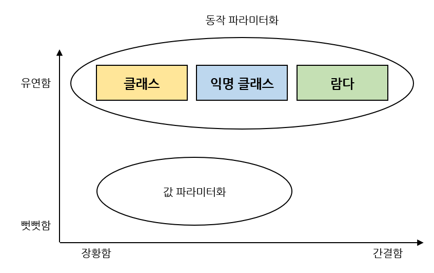

# 개괄

변화하는 요구사항에 대비하기 위해 **동작 파라미터화(behavior parameterization)** 을 이용할 수 있다.

동작 파라미터화는 값 파라미터화에 비해 더 유연하게 대처할 수 있다.

우리는 이번 장에서 값을 기반으로 한 파라미터화를 동작 파라미터화로 바꾸고, 그 중에서도 클래스와 익명 클래스보다 더 간결한 **람다** 표현식을 배울 것이다.



# 1. 값 파라미터화

다음은 사과의 색과 무게를 기준으로 분류를 해달라는 농부의 요구사항을 유연하게 대처하기 위해 값 파라미터화를 이용해 최종적으로 완성한 코드이다.

```java
public static List<Apple> filterApples(List<Apple> inventory, Color color, int weight, boolean flag) {
	List<Apple> result = new ArrayList<>();
	for (Apple apple: inventory) {
		if ((flag && apple.getColor().equals(color)) || 
		(!flag && apple.getWeight() > weight)) {
			result.add(apple);
		}
	}
}

List<Apple> greenApples = filterApples(inventory, GREEN, 0, true);
List<Apple> heavyApples = filterApples(inventory, null, 150, false);
```

여기서는 `flag` 가 무엇을 의미하는지 알기 힘들고, 색과 무게 뿐만 아니라 사과의 크기, 모양, 출하지 등으로 사과를 필터링 하고 싶으면 결국 여러 중복된 필터 메서드를 만들거나 모든 것을 처리하는 거대한 하나의 필터 메서드를 구현해야 한다.

이 예제에서는 문자열, 정수, 불리언 등의 **값** 으로 `filterApples` 메서드를 처리했다.

문제가 잘 정의되어 있는 상황에서는 이 방법이 잘 동작할 수 있지만 **동적 파라미터화** 를 이용한다면 어떤 기준으로 사과를 필터링할 것인지 효과적으로 전달할 수 있어 유연성을 얻을 수 있다.

# 2. 동작 파라미터화

## 2-1. 추상적 조건으로 필터링 (클래스)

> 참 또는 거짓을 반환하는 함수를 `Predicate` 라고 한다.

선택 조건을 결정하는 인터페이스를 정의하자.

```java
public interface ApplePredicate {
	boolean test (Apple apple);
}
```

다음 예제처럼 다양한 선택 조건을 대표하는 여러 버전의 ApplePredicate 를 정의할 수 있다.

```java
public class AppleHeavyWeightPredicate implements ApplePredicate {
	public boolean test (Apple apple) {
		return apple.getWeight() > 150;
	}
}

public class AppleGreenColorPredicate implements ApplePredicate {
	public boolean test (Apple apple) {
		return GREEN.equals(apple.getColor());
	}
}
```

위 조건에 따라 filter 메서드가 다르게 동작할 것이라고 예상할 수 있는데, 이를 전략 디자인 패턴이라고 한다.

다음은 위의 `ApplePredicate` 를 이용한 필터 메서드다.

```java
public static List<Apple> filterApples(List<Apple> inventory, ApplePredicate p) {
	List<Apple> result = new ArrayList<>();
	for(Apple apple: inventory) {
		if (p.test(apple)) {
			result.add(apple);
		}
	}
}
```

이렇게 하면 우리가 전달한 `ApplePredicate` 객체에 의해 `filterApples` 메서드의 동작이 결정되는 것이니 이 메서드의 동작을 파라미터화한 것이다.

## 2-2. 코드를 간소화 (익명 클래스)

`filterApples` 메서드의 동작을 직접 파라미터화 했다.

```java
List<Apple> redApples = filterApples(inventory, new ApplePredicate() {
	public boolean test(Apple apple) {
		return RED.equals(apple.getColor());
	}
});
```

## 2-3. 코드를 더 간소화 (람다 표현식)

위의 코드를 자바 8의 람다 표현식을 이용해 더 간단하게 재구현할 수 있다.

```java
List<Apple> result = filterApples(inventory, (Apple apple) -> RED.equals(apple.getColor()));
```

# 3. 리스트 형식으로 추상화

형식 파라미터 T 를 이용해 다른 형식(정수, 문자열, 바나나, 오렌지 등)의 리스트에 필터 메서드를 사용할 수 있다.

```java
public interface Predicate<T> {
	boolean test(T t);
}

public static <T> List<T> filter(List<T> list, Predicate<T> p) { // 형식 파라미터 T 등장
	List<T> result = new ArrayList<>();
	for (T e: list) {
		if (p.test(e)) {
			result.add(e);
		}
	}
}
```

위의 `filter` 메서드에 다양항 타입과 람다 표현식을 넣어서 아래와 같이 유연하게 사용할 수 있다.

```java
List<Apple> redApples = filter(inventory, (Apple apple) -> RED.equals(apple.getColor()));

List<Integer> evenNumbers = filter(numbers, (Integer i) -> i % 2 == 0);
```


# 추가: `Interface Predicate<T>`

> 출처: [docs.oracle.com](https://docs.oracle.com/javase/8/docs/api/java/util/function/Predicate.html)

Type Parameters:

    T: the type of the input to the predicate (측정할 input 의 타입)

Functional Interface:

    This is a functional interface and can therefore be used as the assignment target for a lambda expression or method reference. (이것은 함수 인터페이스이고, 람다 표현식이나 메서드 참조의 할당 대상으로 사용할 수 있다.)

사용 가능한 함수들:

| Modifier and Type           | Method and Description                                                                                                                                     |
| --------------------------- | ---------------------------------------------------------------------------------------------------------------------------------------------------------- |
| default Predicate\<T\>      | **and(Predicate\<? super T> other)**<br />Returns a composed predicate that represents a short-circuiting logical AND of this predicate and another. |
| static\<T\> Predicate\<T\> | **isEqual(Object targetRef)**<br />Returns a predicate that tests if two arguments are equal according to Objects.equals(Object, Object).            |
| default Predicate\<T\>      | **negate()**<br />Returns a predicate that represents the logical negation of this predicate.                                                        |
| default Predicate\<T\>      | **or(Predicate<? super T> other)**<br />Returns a composed predicate that represents a short-circuiting logical OR of this predicate and another.    |
| boolean                     | **test(T t)**<br />Evaluates this predicate on the given argument.                                                                                   |

# 추가: 전략 디자인 패턴

[티스토리 블로그](https://victorydntmd.tistory.com/292)
