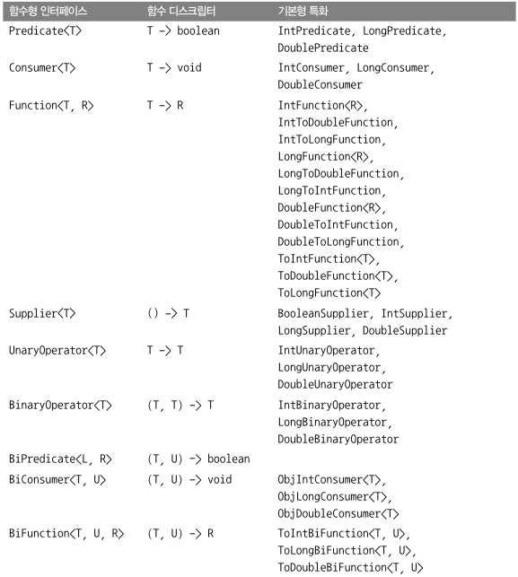

### 3.1. 람다란 무엇인가?

**람다 표현식** 은 메서드로 전달할 수 있는 익명 함수를 단순화한 것이라고 할 수 있다.

람다 표현식에는 이름은 없지만 파라미터 리스트, 바디, 반환 형식, 발생할 수 있는 예외 리스트는 가질 수 있다.

람다의 특징들:

- 익명:
  - 보통의 메서드와 달리 이름이 없으므로 **익명** 이라 표현한다. 구현해야 할 코드에 대한 걱정거리가 줄어든다.
- 함수:
  - 람다는 메서드처럼 특정 클래스에 종속되지 않으므로 함수라고 부른다. 하지만 메서드처럼 파라미터 리스트, 바디, 반환 형식, 가능한 예외 리스트를 포함한다.
- 전달:
  - 람다 표현식을 메서드 인수로 전달하거나 변수로 저장할 수 있다.
- 간결성:
  - 익명 클래스처럼 많은 자질구레한 코드를 구현할 필요가 없다.

lambda 라는 용어는 람다 미적분학 학계에서 개발한 시스템에서 유래 했으며, 람다 표현식은 코드를 간결하고 유연하게 만든다.

---


**람다 구성요소**

```java
(Apple a1, Apple a2) -> a1.getWeight().compareTo(a2.getWeight());
```

- 파라미터 리스트
  - Comparator의 compare 메서드 파라미터(사과 두개)
- 화살표
  - 화살표 `->` 는 람다의 파라미터 리스트와 바디를 구분한다.
- 람다 바디
  - 두 사과의 무게를 비교한다. 람다의 반환값에 해당하는 표현식이다.

---


**자바 8의 유효한 람다 표현식**

- `(String s) -> s.length()`
  - String 형식의 파라미터 하나를 가지며 int 를 반환한다. 람다 표현식에는 return 이 함축되어 있으므로 return 문을 명시적으로 사용하지 않아도 된다.
- `(Apple a) -> a.getWeight() > 150`
  - Apple 형식의 파라미터 하나를 가지며 boolean(사과가 150그램 보다 무거운지 결정)을 반환한다.
- `(int x, int y) -> { System.out.println("Result:"); System.out.println(x + y); }`
  - int 형식의 파라미터 두개를 가지며 리턴갑싱 없다 (void 리턴). 이 예제에서 볼 수 있듯이 람다 표현식은 여러 행의 문장을 포함할 수 있다.
- `() -> 42`
  - 파라미터가 없으며 int 42 를 반환한다.
- `(Apple a1, Apple a2) -> a1.getWeight().compareTo(a2.getWeight())`
  - Apple 형식의 파라미터 두 개를 가지며 int(두 사과의 무게 비교 결과)를 반환한다.

> 다음은 람다의 문법이다.
>
> 1. (parameters) -> expression | *표현식 스타일 expression style*
> 2. (parameters) -> { statements; } | *블록 스타일 block-style*

---


**람다 예제와 사용 사례**

| 사용 사례          | 람다 예제                                                        |
| ------------------ | ---------------------------------------------------------------- |
| 불리언 표현식      | (List\<String\> list) -> list.isEmpty()                         |
| 객체 생성          | () -> new Apple(10)                                              |
| 객체에서 소비      | (Apple a) -> { System.out.println(a.getWeight());}               |
| 객체에서 선택/추출 | (String s) -> s.length()                                         |
| 두 값을 조합       | (int a, int b) -> a * b                                          |
| 두 객체 비교       | (Apple a1, Apple a2) -> a1.getWeight().compareTo(a2.getWeight()) |


### 3.2 어디에, 어떻게 람다를 사용할까?

함수형 인터페이스라는 문맥에서 람다 표현식을 사용할 수 있다.

#### 3.2.1 함수형 인터페이스

**함수형 인터페이스** 는 정확히 하나의 추상 메서드를 지정하는 인터페이스다. 지금까지 살펴본 자바 API의 함수형 인터페이스로 Comparator, Runnable 등이 있다.

인터페이스는 **디폴트 메서드**를 포함할 수 있다. 많은 디폴트 메서드가 있더라도 추상 메서드가 오직 하나면 함수형 인터페이스다.

```java
public interface Comparator<T> {
	int compare(T o1, T o2);
}

public interface Runnable {
	void run();
}

public interface ActionListener extends EventListener {
	void actionPerformed(ActionEvent e);
}

public interface Callable<V> {
	V call() throws Exception;
}

public interface PriviliegedAction<T> {
	T run();
}
```


#### 3.2.2 함수 디스트립터

함수형 인터페이스의 추상 메서드 시그니처(C 에서 프로토타입)는 람다 표현식의 시그니처를 가리킨다. 람다 표현식의 시그니처를 서술하는 메서드를 **함수 디스크립터(function descriptor)** 라고 부른다.

예를 들어 `(Apple, Apple) -> int` 는 두 개의 Apple 을 인수로 받아 int 를 반환하는 함수를 가리킨다.

> process(() -> System.out.println("This is awesome"));
>
> 위 코드에서 람다 바디에서 중괄호를 사용할 수 없다. 자바 언어 명세에서는 void 를 반환하는 메소드 호출과 관련한 특별한 규칙을 정하고 있기 때문이다. 즉 한 개의 void 메소드 호출은 중괄호로 감쌀 필요가 없다.

---

자바 언어 설계자들은 자바에 함수 형식을 추가하는 방법도 대안으로 고려했지만, 언어를 더 복잡하게 만들지 않는 현재의 함수형 인터페이스를 인수로 받는 메서드에만 람다 표현식을 사용하는 방법을 택했다.

### 3.3 람다 활용 : 실행 어라운드 패턴

실제 자원을 처리하는 코드를 `설정`과 `정리` 두 과정이 둘러싸는 형태를 갖는 패턴을 **실행 어라운드 패턴(execute around pattern)** 이라고 부른다.


실행 단계:

1. 동작 파라미터화를 기억하라
2. 함수형 인터페이스를 이용해서 동작 전달
3. 동작 실행
4. 람다 전달

코드 내용: 실행_어라운드_패턴.md 참고

### 3.4 함수형 인터페이스 사용

함수형 인터페이스의 추상 메서드 시그니처를 **함수 디스크립터(function descriptor)** 라고 한다.

다양한 람다 표현식을 사용하려면 공통의 함수 디스크럽터를 기술하는 함수형 인터페이스 집합이 필요하다. 자바 API 는 Comparable, Runnable, Callable 등의 다양한 함수형 인터페이스를 포함하고 있다.

(Predicate, Consumer 코드 생략)

#### 3.4.3 Function

`java.util.function.Function<T, R>` 인터페이스는 제네릭 형식 T를 인수로 받아서 제네릭 형식 R 객체를 반환하는 추상 메서드 apply를 정의한다. 입력을 출력으로 매핑하는 람다를 정의할 때 Function 인터페이스를 활용할 수 있다. (ex. 사과의 무게 정보를 추출하거나 문자열을 길이와 매핑)

다음은 String 리스트를 인수로 받아 각 String 의 길이를 포함하는 Integer 리스트로 변환하는 map 메서드를 정의하는 예제다.

**Function 예제**

```java
@FunctionalInterface
public interface Function<T, R> {
	R apply(T t);
}

public <T, R> List<R> map(List<T>, Function<T, R> f) {
	List<R> result = new ArrayList<>();
for (T t: list) {
		result.add(f.apply(t));
	}
	return result;
}

// [7, 2, 6]
List<Integer> l = map(
	Arrays.asList("lambdas", "in", "action"),
	(String s) -> s.length() // <- Function의 apply 메서드를 구현하는 람다
);
```

---

**기본형 특화**

제네릭이 아닌 기본 타입에 특화된 함수형 인터페이스도 있다. (박싱, 언박싱을 피하기 위해)



---

**예외, 람다, 함수형 인터페이스의 관계**

함수형 인터페이스는 확인된 예외를 던지는 동작을 허용하지 않는다. 즉, 예외를 던지는 람다 표현식을 만들려면 확인된 예외를 선언하는 함수형 인터페이스를 직접 정의하거나 람다를 try/catch 블록으로 감싸야 한다.

ex) IOException 을 명시적으로 선언하는 함수형 인터페이스 BufferedReaderProcessor 를 예시로 들면

```java
@FunctionalInterface
public interface BufferedReaderProcessor {
	String process(BufferedReader b) throws IOException;
}
BufferedReaderProcessor p = (BufferedReader br) -> br.readLine();
```

그러나 우리는 `Function<T, R>` 형식의 함수형 인터페이스를 기대하는 API를 사용하고 있으며 직접 함수형 인터페이스를 만들기 어려운 상황이다. 이런 상황에서는 다음 예제처럼 명시적으로 확인된 예외를 잡을 수 있다.

```java
Function<BufferedReader, String> f = (BufferedReader b) -> {
	try {
		return b.readLine();
	} catch (IOException e) {
		throw new RuntimeException(e);
	}
};

```


### 3.5 형식 검사, 형식 추론, 제약

람다 표현식 자체에는 람다가 어떤 함수형 인터페이스를 구현하는지의 정보가 포함되어 있지 않다. 따라서 람다 표현식을 더 제대로 이해하려면 람다의 실제 형식을 파악해야 한다.

#### 3.5.1 형식 검사

람다가 사용되는 콘텍스트(context) 를 이용해서 람다의 형식(type)을 추론할 수 있다. 어떤 콘텍스트(예를 들면 람다가 전달될 메서드 파라미터나 람다가 할당되는 변수 등)에서 기대되는 람다 표현식의 형식을 **대상 형식(target type)** 이라고 부른다. 람다 표현식을 사용할 때 실제 어떤 일이 일어나는지 보여주는 예제를 확인하자.

```java
List<Apple> heavierThan150g = filter(inventory, (Apple apple) -> apple.getWeight() > 150);
```

다음과 같은 순서로 형식 확인 과정이 진행된다.

1. filter 메서드의 선언을 확인한다.
2. filter 메서드는 두 번째 파라미터로 Predicate\<Apple\> 형식 (대상 형식)을 기대한다.
3. Predicate\<Apple\> 은 test 라는 한 개의 추상 메서드를 정의하는 함수형 인터페이스다.
4. test 메서드는 Apple을 받아 boolean 을 반환하는 함수 디스크립터를 묘사한다.
5. filter 메서드로 전달된 인수는 이와 같은 요구사항을 만족해야 한다.

#### 3.5.2 같은 람다, 다른 함수형 인터페이스

#### 3.5.3 형식 추론

#### 3.5.4 지역 변수 사용

### 3.6 메서드 참조

메서드 참조를 이용하면 기존의 메서드 정의를 재활용해서 람다를 전달할 수 있다.

**기존 코드**:

```java
inventory.sort((Apple a1, Apple a2) -> a1.getWeight().compareTo(a2.getWeight()));
```

다음은 메서드 참조와 `java.util.Comparator.comparing` 을 활용한 코드다.

```java
inventory.sort(comparing(Apple::getWeight));
```

#### 3.6.1 요약

**람다와 메서드 참조 단축 표현 예제**

- (Apple apple) -> apple.getWeight()
  - Apple::getWeight
- () -> Thread.currentThread().dumpStack()
  - Thread.currentThread()::dumpStack
- (str, i) -> str.substring(i)
  - String::substring
- (String s) -> System.out.println(s)
  - System.out.println
- (String s) -> this.isValidName(s)
  - this::isValidName

---

**메서드 참조를 만드는 방법**

1. 정적 메서드 참조:
   - 예를 들어 Integer 의 parseInt 메서드는 Integer::parseInt 로 표현할 수 있다.
2. 다양한 형식의 인스턴스 메서드 참조:
   - 예를 들어 String 의 length 메서드는 String::length 로 표현할 수 있다.
3. 기존 객체의 인스턴스 메서드 참조:
   - 예를 들어 Transaction 객체를 할당받은 expensiveTransaction 지역 변수가 있고, Transaction 객체에는 getValue 메서드가 있다면, 이를 expensiveTransaction::getValue 라고 표현할 수 있다.


#### 3.6.2 생성자 참조

```java
Supplier<Apple> c1 = () -> new Apple();
Apple a1 = c1.get();
// 위를 아래와 같이 요약
Supplier<Apple> c1 = Apple::new;
Apple a1 = c1.get();
```


```java
Function<Integer, Apple> c2 = (weight) -> new Apple(weight);
Apple a2 = c2.apply(110);
// 위를 아래와 같이 요약
Function<Integer, Apple> c2 = Apple::new;
Apple a2 = c2.apply(110);
```


```java
BiFunction<String, Integer, Apple> c3 = (color, weight) -> new Apple(color, weight);
Apple a3 = c3.apply(GREEN, 110);
// 위를 아래와 같이 요약
BiFunction<Color, Integer, Apple> c3 = Apple::new;
Apple a3 = c3.apply(GREEN, 110);
```


인스턴스화 하지 않고도 생성자에 접근할 수 있는 기능을 다양한 상황에 응용할 수 있다. 예를 들어 Map으로 생성자와 문자열값을 관련시킬 수 있다. 그리고 String과 Integer 가 주어졌을 때 다양한 무게를 갖는 여러 종류의 과일을 만드는 giveMeFruit 라는 메서드를 만들 수 있다.

```java
static Map<String, Function<Integer, Fruit>> map = new HashMap<>();
static {
	map.put("apple", Apple::new);
	map.put("orange", Orange::new);
}

public static Fruit giveMeFruit(String fruit, Integer weight) {
	return map.get(fruit.toLowerCase()) // 여기서 fruit 문자열이 있는 과일을 얻고
		.apply(weight); // apply 메서드에 정수 무게 파라미터를 제공해서 Fruit를 만들 수 있다.
}
```

### 3.7 람다, 메서드 참조 활용하기

처음에 다룬 사과 리스트를 다양한 정렬 기법으로 정렬하는 문제로 다시 돌아가서 이 문제를 더 세련되고 간결하게 해결하는 방법을 보여주면서 3장에서 배운 람다를 마무리한다.

`intenvory.sort(comparing(Apple::getWeight));`

#### 3.7.1 1단계: 코드 전달

sort의 동작은 파라미터화되었다.

```java
public class AppleComparator implements Comparator<Apple> {
	public int compare(Apple a1, Apple a2) {
		return a1.getWeight().compareTo(a2.getWeight());
	}
}
inventory.sort(new AppleComparator());
```

#### 3.7.2 2단계: 익명 클래스 사용

한 번만 사용할 Comparator를 위 코드처럼 구현하는 것보다는 **익명 클래스**를 이용하는 것이 좋다.

```java
inventory.sort(new Comparator<Apple>() {
	public int compare(Apple a1, Apple a2) {
		return a1.getWeight().compareTo(a2.getWeight());
	}
});
```

#### 3.7.3 3단계: 람다 표현식 사용

추상 메서드의 시그니처(함수 디스크립터라 불림)는 람다 표현식의 시그니처를 정의한다.

```java
inventory.sort((Apple a1, Apple a2) ->
	a1.getWeight().compareTo(a2.getWeight())
);
```

#### 3.7.4. 4단계: 메서드 참조 사용

```java
import java.util.Comparator.comparing;

inventory.sort(comparing(Apple::getWeight));
```

### 3.8 람다 표현식을 조합할 수 있는 유용한 메서드

#### 3.8.1 Comparator 조합

#### 3.8.2 Predicate 조합

#### 3.8.3 Function 조합

`g(f(x))` 또는 `(g o f)(x)`

```java
Function<Integer, Integer> f = x -> x + 1;
Function<Integer, Integer> g = x -> x * 2;
Function<Integer, Integer> h = f.andThen(g);
int result = h.apply(1); // 4를 반환
```

`andThen` 대신에 `compose` 를 사용하면 `g(f(x))` 가 아니라 `f(g(x))` 가 된다.

```java
Function<Integer, Integer> f = x -> x + 1;
Function<Integer, Integer> g = x -> x * 2;
Function<Integer, Integer> h = f.compose(g);
int result = h.apply(1); // 3을 반환
```

잘 이해 되지 않는 경우의 예시:

```java
Function<String, String> addHeader = Letter::addHeader;
Function<String, String> transformationPipeline =
	addHeader.andThen(Letter::checkSpelling)
		.andThen(Letter::addFooter);
```

### 3.9 비슷한 수학적 개념
